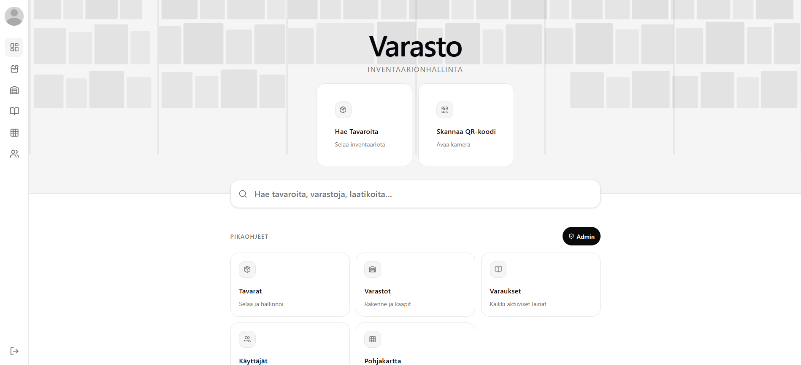
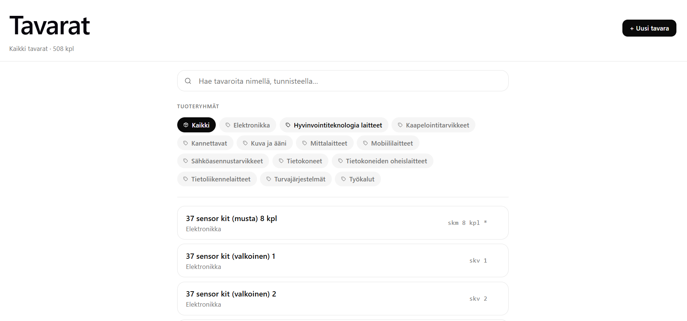
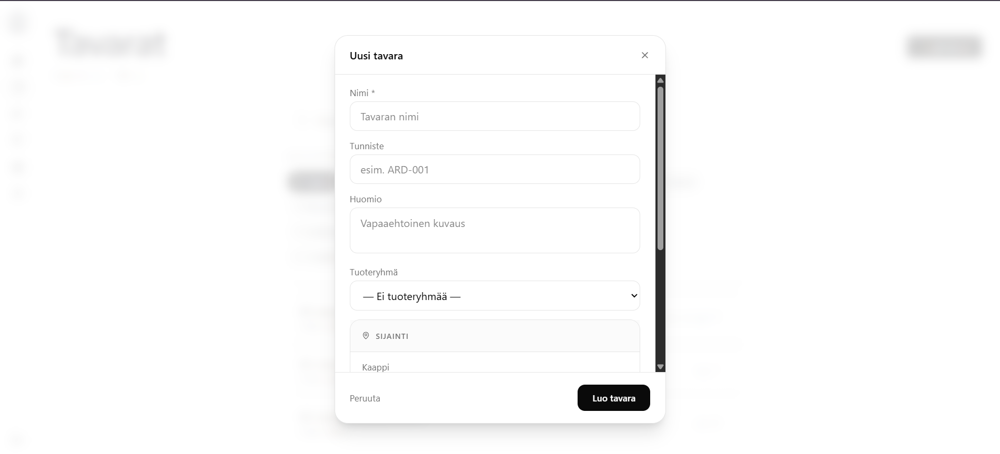
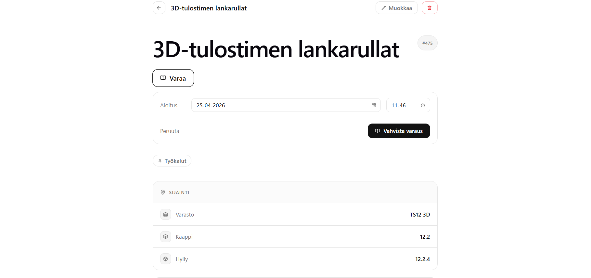
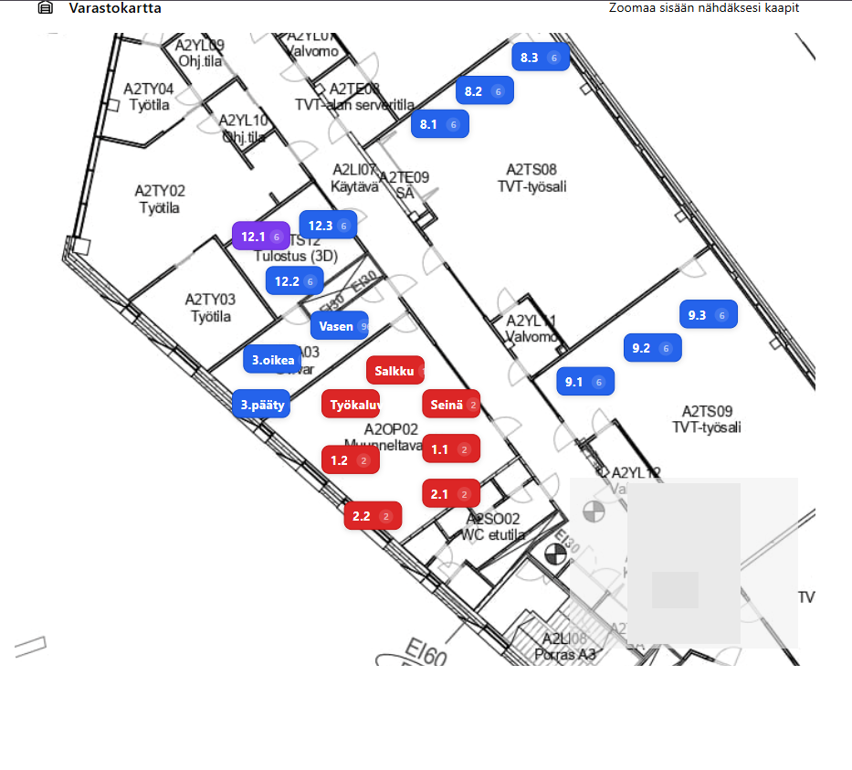
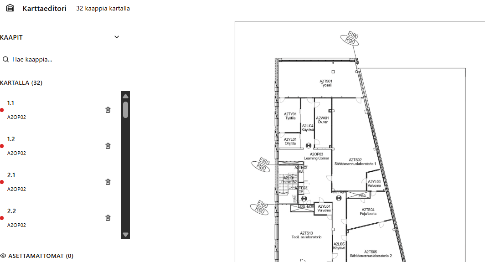

# Varasto

**Tekijä:** Risto Toivanen  

## Lisenssi

© 2026 Risto Toivanen. Kaikki oikeudet pidätetään.  
Katso [LICENSE](LICENSE).

Selainpohjainen inventaarionhallintajärjestelmä, joka korvaa hajanaisen fyysisen inventaarinseurannan. Järjestelmä tarjoaa yhden keskitetyn paikan tavaroille, varastoille, kaapeille ja varauksille — roolipohjaisen käyttöoikeuksien hallinnan ja interaktiivisen pohjakarttaintegraation kera.
Kyseinen projekti on minimoitu todellisesta tuotantoprojektista sisäpiiri informaatioiden ja yrityssalaamisen vuoksi.

---

## Kuvakaappaukset


*Dashboard — aloitusnäkymä ja pikaohjeet*


*Tavarat — listaus, haku ja tuoteryhmäsuodatus*


*Uusi tavara — lomake sijainnin valinnalla*


*Tavaranäkymä — sijainti, varaus ja muokkaus*


*Varastokartta — kaapit pohjapiirustuksella*


*Karttaeditori — kaappien sijoittelu kartalle*

---

## Teknologiapino

| Kerros | Teknologia | Versio |
|--------|-----------|--------|
| Käyttöliittymä | Vue.js 3 | 3.4+ |
| Palvelin | Node.js + Express | Node 20 LTS |
| Tietokanta | MariaDB | 10.6 |
| Autentikointi | JWT + bcrypt | — |
| API-dokumentaatio | Swagger UI (swagger-jsdoc + swagger-ui-express) | — |
| Versionhallinta | Git | — |
| API-suojaus | Rate limiting (express-rate-limit) | — |
| Syötteiden validointi | express-validator | — |
| Tietoturva | Helmet (HTTP security -otsikot) | — |
| Pakkaus | Compression (gzip) | — |
| Tiedostojen käsittely | Multer (CSV/JSON-tuonti) | — |
| CSV-käsittely | csv-parse / csv-stringify | — |

---

## Toiminnot ja prioriteetit

### Korkea prioriteetti — toteutettu

- Käyttäjähallinta ja tietoturvallinen kirjautuminen (JWT + bcrypt, httpOnly-eväste)
- Roolipohjainen käyttöoikeudenhallinta (`kayttoluvat`-taulu, admin-suojatut reitit)
- Täysi inventaariohierarkia: Varasto → Kaappi → Hylly → Tavara / Laatikko
- Tavaroiden hallinta: listaus, luonti, muokkaus, poisto, haku nimellä/tunnisteella/tagilla
- Varausjärjestelmä (lainaus, palautus, aktiiviset lainat)
- Tuoteryhmähallinta kategorisoinnin tueksi
- Admin-hallintapaneeli: käyttäjien, roolien ja rakenteiden hallinta
- Yhtenäinen hakutoiminto kaikkien entiteettien yli (`/api/search`)
- Tilastot ja dashboard-data (kokonaismäärät, varastokohtaiset, ryhmäkohtaiset, aktiivisuus)
- Pohjakarttaeditori: kaappien sijoittaminen rakennuspohjalle visuaalisesti
- QR-koodin skannaus tavaroiden nopeaan hakuun (kameratuki selaimessa)
- API-dokumentaatio Swagger UI:lla (`/docs`)

### Keskiprioriteetti — toteutettu

- CSV- ja JSON-tuonti/vienti tavaroille ja varauksille (bulk-import/export)
- Täysi varaston rakennepuu JSON-vientinä

### Rajattu pois, voidaan toteuttaa tulevaisuudessa

- Sähköposti-ilmoitukset varauksista ja eräpäivistä
- Barcode-tulostus suoraan järjestelmästä
- Testit
---

## Tietokantarakenne

| Taulu | Kuvaus |
|-------|--------|
| `kayttaja_tiedot` | Käyttäjät: nimi, bcrypt-salasana, aktiivisuus, rooli-viite |
| `kayttoluvat` | Käyttöoikeusroolit ja niiden oikeudet |
| `varastot` | Varastot — hierarkian ylin taso |
| `kaapit` | Kaapit varastoissa; viite varastoon |
| `hyllyt` | Hyllyt kaapeissa; viite kaappiin |
| `tavarat` | Inventaarioesineet: nimi, tunniste, huomio, tuoteryhmä, sijainti |
| `tuoteryhmat` | Tuoteryhmät kategorisointiin |
| `laatikot` | Säilytyslaatikot tavaroille |
| `varaukset` | Lainaukset: tavara, käyttäjä, aloitus, palautus, tila |

Suhteet: `varastot` 1→N `kaapit`, `kaapit` 1→N `hyllyt`, `hyllyt` 1→N `tavarat`, `kayttaja_tiedot` 1→N `varaukset`, `tavarat` 1→N `varaukset`.

---

## API-reitit

| Metodi | Reitti | Kuvaus |
|--------|--------|--------|
| `POST` | `/api/auth/login` | Kirjautuminen, asettaa JWT-evästeen |
| `POST` | `/api/auth/logout` | Uloskirjautuminen, poistaa evästeen |
| `GET` | `/api/auth/me` | Palauttaa kirjautuneen käyttäjän |
| `GET` | `/api/search` | Yhtenäinen haku kaikkien entiteettien yli |
| `GET / POST` | `/api/items` | Listaa / luo tavara |
| `GET / PUT / PATCH / DELETE` | `/api/items/:id` | Hae / muokkaa / poista tavara |
| `GET` | `/api/items/search` | Hae nimellä, tagilla tai huomiolla |
| `GET / POST` | `/api/warehouses` | Listaa / luo varasto (admin) |
| `GET / PUT / DELETE` | `/api/warehouses/:id` | Hae / muokkaa / poista varasto |
| `GET` | `/api/warehouses/:id/items` | Listaa varaston tavarat |
| `GET / POST` | `/api/cabinets` | Listaa / luo kaappi (admin) |
| `GET / POST` | `/api/shelves` | Listaa / luo hylly (admin) |
| `GET / POST` | `/api/product-groups` | Listaa / luo tuoteryhmä |
| `GET / POST` | `/api/boxes` | Listaa / luo laatikko |
| `GET / POST` | `/api/reservations` | Listaa / luo varaus |
| `PATCH` | `/api/reservations/:id/return` | Merkitse varaus palautetuksi |
| `GET / POST` | `/api/users` | Listaa / luo käyttäjä (admin) |
| `PATCH` | `/api/users/:id/password` | Vaihda salasana (admin tai itse) |
| `PATCH` | `/api/users/:id/status` | Aktivoi / deaktivoi käyttäjä (admin) |
| `GET / POST` | `/api/roles` | Listaa / luo rooli (admin) |
| `GET` | `/api/stats` | Kokonaistilastot dashboardille |
| `GET` | `/api/stats/warehouses` | Varastokohtaiset tilastot |
| `GET` | `/api/stats/activity` | Varausaktiivisuus päivittäin |
| `GET` | `/api/export/items.csv` | Vie tavarat CSV-muodossa |
| `GET` | `/api/export/items.json` | Vie tavarat JSON-muodossa |
| `POST` | `/api/import/items/csv` | Tuo tavarat CSV-tiedostosta (admin) |
| `POST` | `/api/import/items/json` | Tuo tavarat JSON-muodossa (admin) |
| `GET` | `/api/health` | Palvelun terveystarkistus (ei autentikointia) |

Kaikki reitit autentikoinnin jälkeen vaativat kelvollisen JWT-tokenin (httpOnly-evästeessä). Admin-reitit vaativat lisäksi admin-roolin.

Samat polut löytyvät myös swaggertiedostosta
---

## Tietoturva

| Osa-alue | Ratkaisu |
|----------|----------|
| Salasanat | jwt-hajautus — ei koskaan selkokielisinä |
| Kirjautuminen | JWT httpOnly-evästeessä, vanhenee 8 h:n jälkeen |
| Käyttöoikeudet | Roolipohjainen pääsynhallinta (`kayttoluvat`-taulu) |
| HTTP-otsikot | Helmet (CSP, HSTS, X-Frame-Options jne.) |
| Syötteiden validointi | express-validator kaikissa POST/PUT/PATCH-reiteissä |
| Väärinkäytösten esto | Rate limiting kirjautumiseen ja kaikille reiteille |
| CORS | Rajattu `CORS_ORIGIN`-ympäristömuuttujalla |
| Evästeet | `httpOnly`, `sameSite: lax`; tuotannossa `secure: true` |
| Ympäristömuuttujat | `.env`-tiedosto — ei commitoida repositoryyn |

---

## Projektirakenne

```
varasto-api-main/
├── .github/
│   └── workflows/
│       └── build-docker.yml
├── backend/
│   ├── src/
│   │   ├── config/
│   │   │   ├── db.js
│   │   │   └── swagger.js
│   │   ├── db/
│   │   │   └── pool.js
│   │   ├── middleware/
│   │   │   ├── auth.js
│   │   │   ├── index.js
│   │   │   ├── rateLimiters.js
│   │   │   └── validate.js
│   │   └── routes/
│   │       ├── auth.js
│   │       ├── catalog.js
│   │       ├── hyllyt.js
│   │       ├── importexport.js
│   │       ├── items.js
│   │       ├── kaapit.js
│   │       ├── kayttajat.js
│   │       ├── kayttoluvat.js
│   │       ├── laatikot.js
│   │       ├── locations.js
│   │       ├── reservations.js
│   │       ├── roles.js
│   │       ├── search.js
│   │       ├── stats.js
│   │       ├── tavarat.js
│   │       ├── tuoteryhmat.js
│   │       ├── users.js
│   │       └── warehouses.js
│   ├── .dockerignore
│   ├── .env.example
│   ├── Dockerfile.dev
│   ├── index.js
│   ├── package.json
│   └── package-lock.json
├── frontend/
│   ├── public/
│   │   ├── images/              # Pohjakarttakuvat per varasto
│   │   ├── favicon.png
│   │   ├── favicon.svg
│   │   └── icons.svg
│   └── src/
│       ├── api/                 # Axios-kutsut per entiteetti
│       ├── assets/
│       ├── components/
│       │   ├── includes/        # Navbar, footer
│       │   ├── ui/              # shadcn/ui-komponentit
│       │   ├── VarastoPohjakartta/  # Karttakomponentit
│       │   └── Varaus/          # Varaushistoria
│       ├── lib/
│       ├── router/
│       ├── stores/              # Pinia: auth, QR-paneeli
│       └── views/
│           ├── CabinetView.vue
│           ├── Home.vue
│           ├── Items.vue
│           ├── Itemview.vue
│           ├── Login.vue
│           ├── MapEditor.vue
│           ├── Profile.vue
│           ├── Reservations.vue
│           ├── ShelfView.vue
│           ├── Users.vue
│           ├── Warehouses.vue
│           ├── WarehouseView.vue
│           └── overlay/
│               └── FromQRCode.vue
├── .gitignore
├── docker-compose.yml
├── dockerfile
└── varasto.sql
```

---

## Asennus

### Vaatimukset

- Docker ja Docker Compose (suositeltu)
- TAI: Node.js 20 LTS + MariaDB 10.6 (manuaalinen)

### Tuotantokäynnistys

```bash
docker compose --profile production up --build
```

Käynnistää backendin, frontendin ja tietokannan. Backend tarjoilee Vue-buildin `/public`-kansiosta portista 3000.

### Kehityskäynnistys

```bash
docker compose --profile development up --build
```

Backend nodemon-tilassa portissa 3000, frontend Vite HMR -tilassa portissa 5173.

### Ympäristömuuttujat

Kopioi `backend/.env.example` → `backend/.env` ja täytä arvot:

```env
DB_HOST=db
DB_PORT=3306
DB_USER=varasto
DB_PASSWORD=salasana
DB_NAME=varasto
JWT_SECRET=pitkä-salainen-avain
JWT_EXPIRES_IN=8h
CORS_ORIGIN=http://localhost:5173
PORT=3000
```

## Commit-käytäntö

Commitit tehdään jokaisen vaiheen päätyttyä. Viestit noudattavat [Conventional Commits](https://www.conventionalcommits.org/) -standardia:

```
feat:     uusi toiminto
fix:      bugikorjaus
docs:     dokumentaatio
style:    ulkoasumuutokset ilman logiikkamuutoksia
refactor: koodin rakenteen parantaminen
```

Esimerkki: `feat: add JWT authentication middleware`

---

## Tunnetut rajoitteet ja haasteet

- CSV-tuonti voi epäonnistua epästandardeilla tiedostorakenteilla — tiedostomuoto on validoitava ennen tuontia.
- Suorituskyky voi heikentyä suurilla datamäärillä — tietokantaindeksointi huomioitava jo kehitysvaiheessa.
- Roolien oikeuksiin voidaan tarvita lisää konfigurointia käyttöönottovaiheessa asiakkaan tarpeiden mukaan.
---

## Tekijä

**Risto Toivanen**
